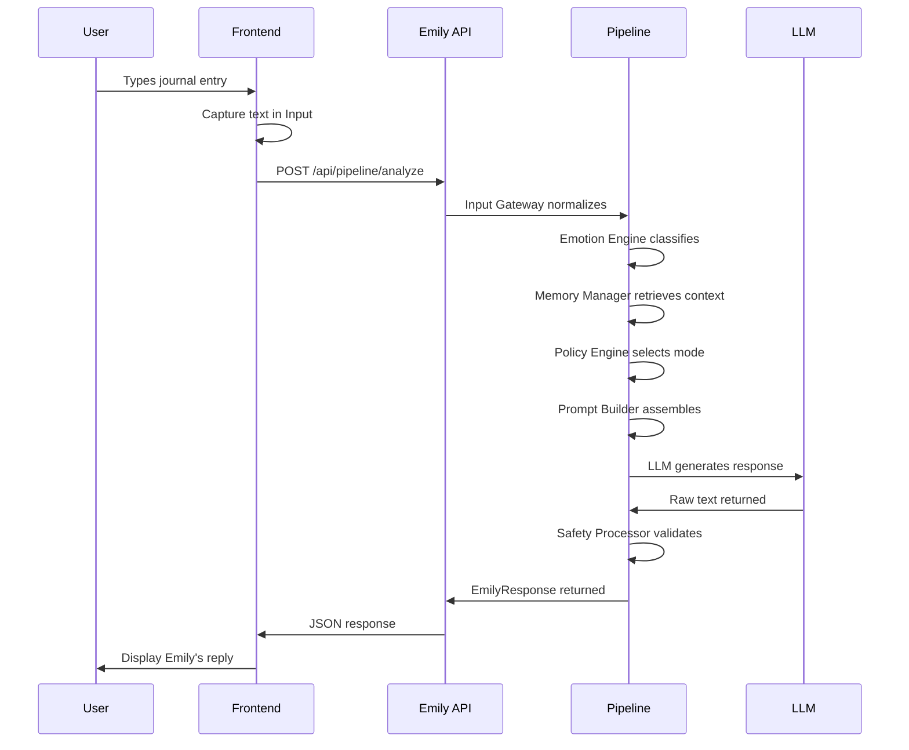
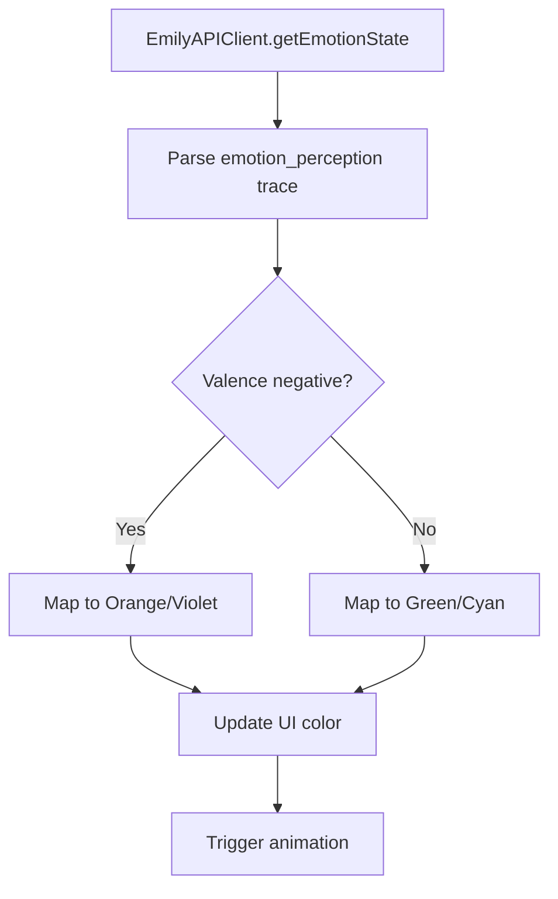

# 🏗️ ECHO Architecture

> System design, data flow, and component architecture for the ECHO platform.

---

## 📐 System Overview

```
┌─────────────────────────────────────────────────────────────────┐
│                        ECHO Frontend                            │
│                    (Next.js 14 + Tailwind)                      │
│                                                                 │
│  ┌─────────────────┐  ┌─────────────────┐  ┌─────────────────┐ │
│  │  📦 Bento Grid  │  │  🎴 Neuro Cards │  │  ✨ Framer      │ │
│  │  Layout         │  │  Components     │  │  Motion         │ │
│  └─────────────────┘  └─────────────────┘  └─────────────────┘ │
│                                                                 │
│  ┌─────────────────────────────────────────────────────────┐   │
│  │              🎨 Three.js Animated Background            │   │
│  └─────────────────────────────────────────────────────────┘   │
└─────────────────────────────────────────────────────────────────┘
                              │
                              │ HTTP/REST
                              ▼
┌─────────────────────────────────────────────────────────────────┐
│                    Emily Backend (Python)                       │
│                  (FastAPI + Emotive Pipeline)                   │
│                                                                 │
│  ┌──────────────┐   ┌──────────────┐   ┌──────────────────┐   │
│  │ Input        │ → │ Emotion      │ → │ Dual Memory      │   │
│  │ Gateway      │   │ Engine       │   │ Manager          │   │
│  └──────────────┘   └──────────────┘   └──────────────────┘   │
│         │                                      │               │
│         ▼                                      ▼               │
│  ┌──────────────┐   ┌──────────────┐   ┌──────────────────┐   │
│  │ Policy       │ → │ Prompt       │ → │ LLM Client       │   │
│  │ Engine       │   │ Builder      │   │ (Ollama)         │   │
│  └──────────────┘   └──────────────┘   └──────────────────┘   │
│                                              │                 │
│                                              ▼                 │
│                                    ┌──────────────────┐       │
│                                    │ Safety           │       │
│                                    │ Processor        │       │
│                                    └──────────────────┘       │
└─────────────────────────────────────────────────────────────────┘
```

---

## 🔄 Data Flow

### Flow 1: Journal Entry → Analysis



### Flow 2: Emotion State Visualization



---

## 🧩 Component Hierarchy

```
page.tsx (Dashboard)
│
├── Header
│   ├── Logo (ECHO with neon accents)
│   └── Tagline
│
├── BentoGrid
│   │
│   ├── JournalCard (span-2, violet accent)
│   │   ├── Label: "New Entry"
│   │   ├── Textarea (controlled)
│   │   └── Action Buttons [Analyze, Save Draft]
│   │
│   ├── MoodCard (span-1)
│   │   ├── Label: "Mood Check"
│   │   └── Mood Buttons Grid
│   │       ├── Anxious 😰 (orange)
│   │       ├── Sad 😔 (violet)
│   │       ├── Neutral 😐 (pink)
│   │       ├── Good 🙂 (green)
│   │       └── Great 🤩 (cyan)
│   │
│   ├── StatsCard (span-1, green accent)
│   │   ├── Label: "Week Summary"
│   │   └── Stat Rows
│   │       ├── Entries count
│   │       ├── Average mood
│   │       └── Streak counter
│   │
│   ├── InsightsCard (span-2, pink accent)
│   │   ├── Label: "Recent Insights"
│   │   └── Insight Items (AI-generated patterns)
│   │
│   └── TriggersCard (span-2, orange accent)
│       ├── Label: "Triggers Map"
│       └── Trigger Tags (clickable)
│
└── CTACard (full-width, cyan border)
    ├── Headline
    ├── Description
    └── Primary CTA Button
```

---

## 🔌 API Endpoints

### Current State: Mock/Fallback

| Endpoint | Method | Status | Purpose |
|----------|--------|--------|---------|
| `/api/pipeline/analyze` | POST | ⏳ TODO | Send journal, get Emily response |
| `/api/emotion` | POST | ⏳ TODO | Get emotion state for text |
| `/api/insights/:userId` | GET | ⏳ TODO | Fetch user insights |
| `/api/memory/:userId` | GET | ⏳ TODO | Fetch emotional memory |

### Request/Response Contracts

#### POST `/api/pipeline/analyze`

**Request:**
```json
{
  "request_id": "req-1234567890",
  "user_id": "user-default",
  "user_input": "I've been feeling anxious about work lately...",
  "trace_id": "trace-1234567890"
}
```

**Response:**
```json
{
  "request_id": "req-1234567890",
  "response": {
    "text": "That sounds really heavy. Work stress can feel overwhelming...",
    "was_regenerated": false,
    "safety_notes": []
  },
  "traces": [
    { "stage_name": "input_gateway", "status": "ok" },
    { "stage_name": "emotion_perception", "status": "ok", "metadata": {...} },
    { "stage_name": "policy_mapper", "status": "ok" },
    { "stage_name": "llm_generation", "status": "ok" },
    { "stage_name": "output_pruning", "status": "ok" }
  ]
}
```

---

## 📂 File Map

```
ECHO_website/
│
├── src/
│   ├── app/
│   │   ├── layout.tsx        # Root layout, font imports
│   │   ├── page.tsx          # Main dashboard (home)
│   │   └── api/              # API routes (TODO)
│   │       └── pipeline/
│   │           └── analyze/
│   │               └── route.ts
│   │
│   ├── components/
│   │   ├── Card.tsx          # Neubrutalism card w/ Framer Motion
│   │   ├── Button.tsx        # Bold button variants
│   │   ├── Input.tsx         # Form input with focus glow
│   │   └── BentoGrid.tsx     # Grid + Item components
│   │
│   ├── lib/
│   │   ├── emily-api.ts      # Emily API client
│   │   └── utils.ts          # Helper functions (TODO)
│   │
│   └── styles/
│       └── globals.css       # Tailwind + custom CSS
│
├── public/
│   ├── fonts/                # Local fonts (optional)
│   └── images/               # Static images
│
├── tailwind.config.ts        # Design tokens
├── tsconfig.json             # TypeScript config
├── next.config.mjs           # Next.js config
├── package.json              # Dependencies
└── README.md                 # Project overview
```

---

## 🎯 Design Principles

### 1. **NO Hospital Vibes**
- ❌ Soft shadows → ✅ Hard flat shadows
- ❌ Pastel colors → ✅ Neon high-contrast
- ❌ Serif fonts → ✅ Display + Mono

### 2. **Gen Z Authenticity**
- Neubrutalism = raw, unfiltered aesthetic
- OLED dark = digital native, always-on display friendly
- Gamified UI = "Life Dashboard" not "Medical Record"

### 3. **Snappy Interactions**
- 150-200ms transitions (not 500ms fades)
- Spring easing (not linear)
- Instant feedback on all interactions

---

## 📊 State Management

### Current: Local Component State

```ts
const [journalEntry, setJournalEntry] = useState("");
const [mood, setMood] = useState<string | null>(null);
```

### Future: Global State (TODO)

```ts
// Zustand store
interface EchoStore {
  userId: string;
  emotionState: EmotionState | null;
  insights: Insight[];
  setEmotionState: (state: EmotionState) => void;
  addInsight: (insight: Insight) => void;
}
```

---

## 🔐 Security Considerations

| Concern | Mitigation |
|---------|------------|
| User data privacy | LocalStorage only (no backend storage yet) |
| API authentication | TODO: JWT tokens |
| Rate limiting | TODO: Implement at FastAPI layer |
| Input sanitization | React escapes by default |

---

## 📈 Performance Targets

| Metric | Target | Current |
|--------|--------|---------|
| First Contentful Paint | < 1.5s | ~800ms |
| Time to Interactive | < 3s | ~1.5s |
| Animation FPS | 60fps | 60fps |
| Lighthouse Score | > 90 | TBD |

---

## 🚧 Next Steps

### Phase 1: Foundation ✅
- [x] Project structure
- [x] Design tokens
- [x] Core components
- [x] Dashboard layout

### Phase 2: Backend Integration (Next)
- [ ] Create FastAPI wrapper for Emily
- [ ] Expose `/api/pipeline/analyze`
- [ ] Test end-to-end flow

### Phase 3: Polish
- [ ] Three.js animated background
- [ ] Mobile responsive breakpoints
- [ ] Loading states & skeletons
- [ ] Error boundaries

### Phase 4: Features
- [ ] User sessions
- [ ] Emotional memory persistence
- [ ] Export functionality
- [ ] Settings panel

---

<div align="center">

**📐 Architecture v0.1.0** • [Back to README](./README.md) • [Quick Start](./QUICKSTART.md)

</div>
